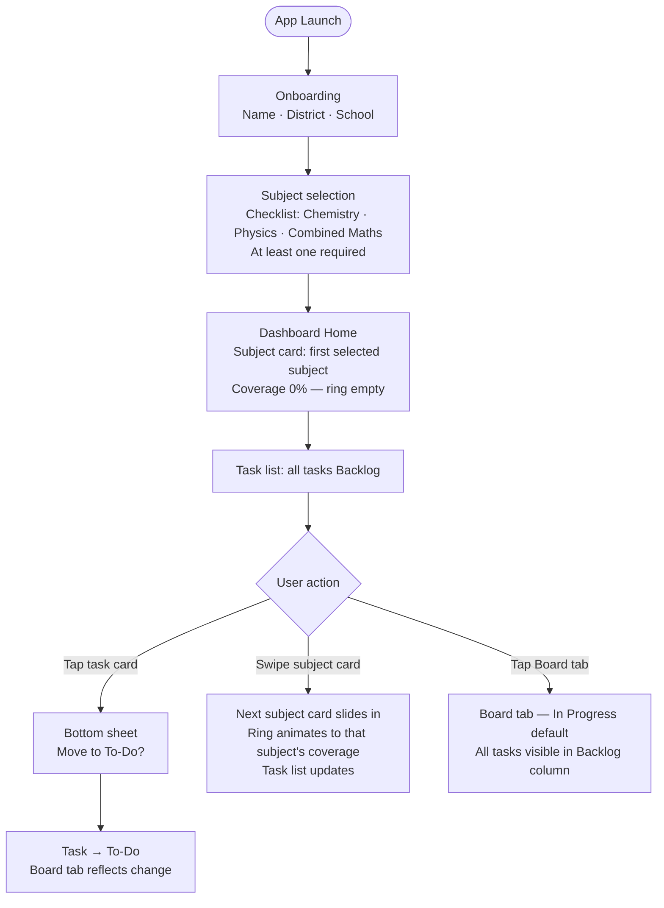
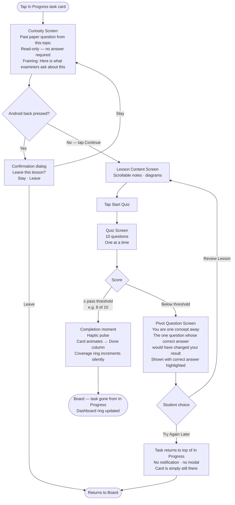
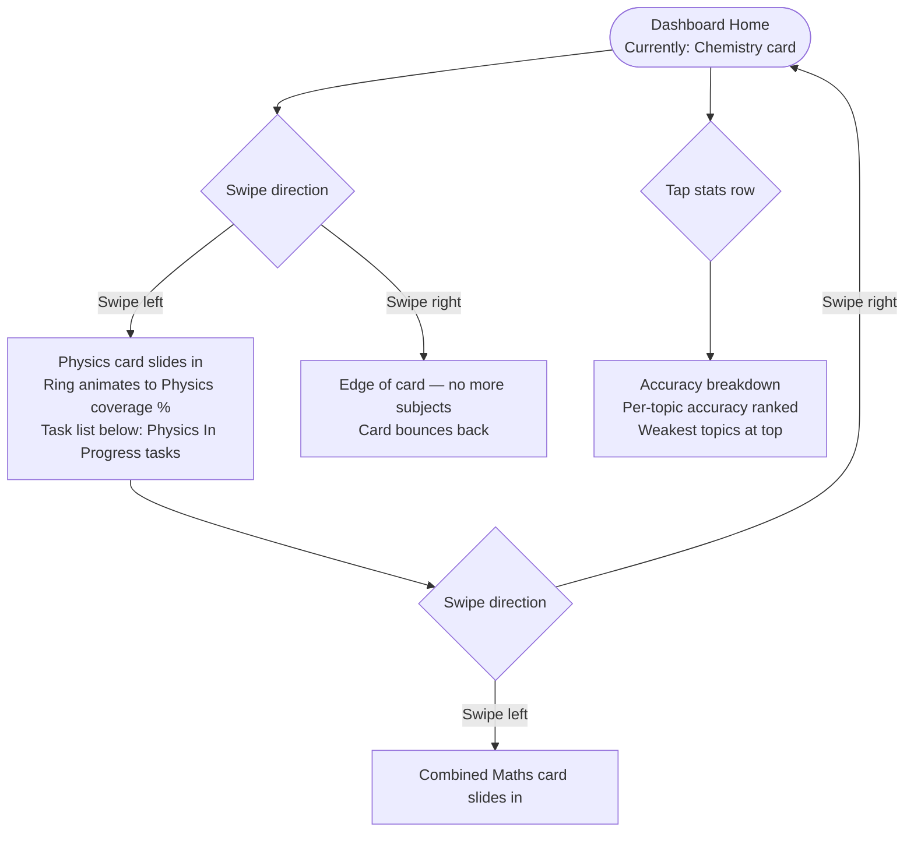
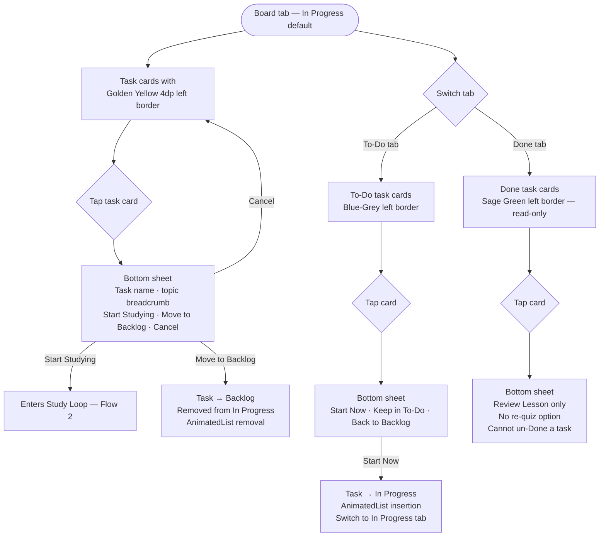
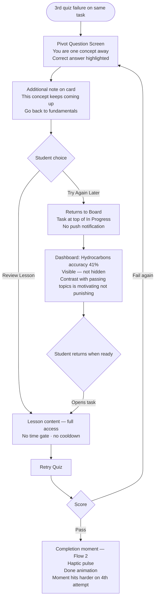

# UX Design Specification — StudyBoard

**Author:** Lahiru
**Date:** 2026-04-15

---

## Executive Summary

### Project Vision

StudyBoard is a mobile-first study operating system for Sri Lankan A/L Chemistry students that treats exam preparation as a managed Agile project. The syllabus is a backlog. Every lesson is a task. "Done" is enforced — a student cannot mark a lesson complete without passing its quiz. The product's emotional promise: replace study anxiety with calm, structured confidence. A student opens the app and knows exactly where they stand, what to do next, and how far they've come.

### Target Users

**Primary: A/L Chemistry students, aged 16–19 in Sri Lanka**
- Android-native, mobile-first; low-to-mid range devices (Redmi 10, Samsung A13 class)
- Many in low-connectivity areas — offline access is not optional, it is baseline
- Study evenings and weekends alongside school and tuition classes
- High-pressure, serious learners — the emotional core is "am I doing enough?"
- Not casual learners seeking content; they need a system to execute what they already have

**Future (architecturally considered, not V1):** Parents seeking progress visibility; tuition instructors as distribution channel and cohort management product.

### Key Design Challenges

1. **Kanban on mobile** — The multi-column Agile board is a desktop-native mental model. The challenge is translating the *feeling* of Kanban — work states, forward momentum, strategy — into mobile-native gestures without porting the desktop visual literally. Drag-and-drop is a trap; tap-to-promote is the path. The student should never see the word "Kanban" — she should simply feel like she has a plan.

2. **Making quiz failure feel safe** — The quiz re-open mechanic is the product's trust mechanism, but it must land emotionally as "not done yet, and that's fine" rather than "you failed." This is the highest-stakes emotional design challenge in the product. The failure screen is the emotional fulcrum — get it wrong and the trust contract breaks. Silence plus color may outperform copy; the card slides back quietly rather than announcing failure.

3. **The curiosity-first flow sequence** — Showing past paper questions before lesson content is non-skippable and non-obvious. The screen must feel conspiratorial (showing the examiner's hand) not evaluative (catching the student out). The framing — "here's where this lesson is taking you" — must make the question feel like a gift, not a trap. Non-skippable must be *earned* through framing, not enforced through friction.

4. **Dopamine-driven UX on constrained hardware** — Haptics, completion animations, and card transitions must run at 60fps on a 3-year-old mid-range Android device. This is a market access problem, not a cosmetic one: a stuttering dopamine loop is a broken promise. One animation at a time, `Transform` over `Opacity`, no `BackdropFilter`, and a single clean haptic pulse on completion. Test exclusively on target hardware.

### Design Opportunities

1. **The completion moment** — When a quiz is passed and the task moves to Done with haptic and animation, this is the product's highest-leverage emotional beat. Designing this single interaction well is the greatest ROI investment in the entire UX.

2. **The dashboard as anxiety antidote** — Rather than a metrics display, the dashboard is an emotional tool: "here's exactly where you are, here's what to do next." The visual hierarchy and information architecture can replace study anxiety with calm confidence — the core emotional promise of the product.

3. **Neutral failure as brand signature** — The "not done yet" framing, extended into a consistent visual language across the app, becomes a product identity: this app does not judge you, it just shows you reality. A gentle coach, never a wall.

---

## Core User Experience

### Defining Experience

The core of StudyBoard is a single, repeating action: **moving a task forward**. Every session, a student arrives knowing what's in motion, picks up where they left off or pulls something new, and advances it toward Done. This loop — pull → study → quiz → Done — is the product's heartbeat. Every screen, transition, and interaction exists to make this loop feel smooth, satisfying, and worth returning to.

The product solves a specific, daily friction: students open their current tools and have no clear plan and no visibility of their execution. StudyBoard collapses that gap at session open — the board shows exactly what's in progress, what's waiting, and what's been verified complete. The relief is immediate and recurring, not just cumulative.

### Platform Strategy

- **Platform:** Android-first mobile application (Flutter/Dart); iOS architecturally supported but not V1 target
- **Interaction model:** Touch-first; all core actions executable with one thumb in one hand
- **Offline:** Full functionality without connectivity — lesson content, quiz completion, and task state changes all work offline; sync is background and invisible to the user
- **Device baseline:** 3-year-old mid-range Android (~2–3GB RAM); all UX decisions must perform smoothly on this hardware class
- **Hardware leverage:** Haptic feedback (VIBRATE) is a first-class interaction layer, not an enhancement — used deliberately at completion moments

### Effortless Interactions

The following interactions must require zero cognitive effort — they should feel automatic, instant, and natural:

- **Session orientation** — Opening the app and instantly knowing what's in progress and what to do next; no loading states, no navigation required
- **Task progression** — Advancing a task through the workflow (tap-to-promote, not drag-and-drop); the action should feel as natural as checking something off a list
- **Quiz entry** — Transitioning from lesson content into the quiz without a separate navigation decision; the flow carries the student forward
- **Progress at a glance** — The dashboard must communicate coverage, accuracy, and next priority without requiring the student to interpret or hunt for information
- **Offline continuity** — Connectivity state changes must be invisible; a student studying on a bus should never notice a sync event or feel interrupted

### Critical Success Moments

| Moment | What must happen |
|---|---|
| **First task completion** | The quiz passes, the haptic fires, the card slides to Done with a visual reward — the student feels that this is real and earned, not just logged |
| **First dashboard view** | The student sees honest, quiz-verified coverage data and immediately knows where they stand — anxiety replaced by clarity |
| **Recovery from failure** | A failed quiz re-opens the task quietly; the student feels neutral momentum ("not done yet") rather than punishment; they re-enter the lesson without friction |
| **Session open** | Within 3 seconds of opening the app, the student knows exactly what to work on — no ambiguity, no decisions required |
| **Curiosity ignition** | The past paper question appears before the lesson and the student feels intrigued, not ambushed — the question creates a "why?" the lesson then answers |

### Experience Principles

1. **Student in the driver's seat** — The app facilitates, never directs. No auto-suggestions, no AI-driven nudges, no forced paths beyond the quiz gate. Every action is a student decision; the app's job is to make that decision easy and satisfying to execute.

2. **Forward momentum is the product** — Every screen should make the next step obvious. Friction in the progression loop — an extra tap, an unclear CTA, a slow transition — is a product failure. The experience of moving a task forward must be faster and more satisfying than any alternative.

3. **Trust through honesty** — Every metric shown is quiz-verified and therefore true. The app never flatters. Coverage is coverage. Done is Done. This honest relationship with data is the product's core differentiator and must be protected in every UI decision.

4. **Guide the first moment, respect autonomy after** — Onboarding rails exist to deliver the first task completion experience. Once that moment lands, the student has enough orientation to self-direct. The opt-out of guidance must be present, accessible, and non-judgmental.

5. **Calm confidence over feature density** — The visual language and information hierarchy should reduce anxiety, not add stimulation. The board and dashboard are tools for clarity. If a screen creates confusion or overwhelm, it has failed its purpose regardless of the data it shows.

---

## Desired Emotional Response

### Primary Emotional Goals

StudyBoard is designed to move students through a deliberate emotional arc across their preparation journey:

| Phase | Target Emotion | What triggers it |
|---|---|---|
| **First session** | Curiosity + orientation | Seeing the entire syllabus as a finite, completable plan for the first time |
| **Early sessions** | Calm clarity | Knowing exactly where to pick up without ambiguity at every session open |
| **Mid-journey** | Fulfillment | Completing tasks that are verified real — the haptic, the animation, the honest dashboard |
| **Long arc** | Brutal honest confidence | Approaching exam day knowing exactly what has been mastered and what hasn't — because every data point was earned |

**The north star:** Brutal honest confidence. Not optimism, not self-belief — *evidence*. A student who can walk into the exam knowing her coverage percentage is real, her weak topics are named, her strengths are proven. The quiz gate makes this confidence unfakeable. That is the emotional differentiator no competitor can claim.

> **Validation note:** "Brutal honest confidence" carries a Western/stoic framing. For Sri Lankan A/L students, confidence is relational and communal — closer to "I am worthy of the trust placed in me" than "I need no external validation." The language and framing of this emotional target should be tested with actual students before being expressed in copy or onboarding.

### Emotional Journey Mapping

**Discovering the product:**
Curiosity and recognition — "this is the system I've been looking for." Not excitement at features, but the quiet relief of seeing a shapeless mountain become a completable list. The mountain does not shrink — but it becomes *countable.*

**During the core loop (study → quiz → Done):**
Focus during study. Intrigue during the curiosity-first warm-up — the past paper question creates a "why?" before the lesson answers it. Earned satisfaction at quiz pass — the haptic and animation confirm that something real just happened.

**At quiz failure — the most dangerous beat:**
Not shame, not frustration — *diagnostic clarity*. The failure screen is not an endpoint; it is an entry point. The student exits knowing more than when they entered: specifically, the **pivot question** — the single question that, if answered correctly, would have changed the outcome. This frames the failure as *one concept away from passing*, not *fundamentally deficient*. The student leaves with one clear next step, not a list of remediation tasks.

> **Design constraint:** Acute failure stress collapses working memory. The failure screen must first reset the student's emotional frame before delivering any diagnostic information. Lead with reframe ("You're one concept away"), then surface the pivot question. The diagnostic serves the student — the student does not serve the diagnostic.

**After completing a task:**
Fulfillment — quiet, intrinsic, real. Not the loud celebration of gamification, but the deep satisfaction of having done something verifiable. The completion moment should feel like a professor nodding, not a crowd cheering. This is the emotion that makes students share their dashboard — not "look at my streak" but "look at what I actually know."

> **Validation note:** "Quiet fulfillment over celebration" reflects a Western minimalist design aesthetic. Whether Sri Lankan A/L students — who may express completion more expressively — respond better to a quieter or more energetic reward is a hypothesis, not a confirmed truth. Prototype and test across multiple completion response variants before committing.

**Returning for the next session:**
Comfort and momentum. The app remembers where they left off. The board shows what's alive and what's done. There is no re-orientation required — just continuation. They return because the last session felt good, not because they feel guilty.

### Micro-Emotions

| Moment | Target micro-emotion | Emotion to avoid |
|---|---|---|
| Session open | Oriented, calm | Lost, overwhelmed |
| Curiosity-first question | Intrigued, primed | Ambushed, stupid |
| Studying lesson content | Focused, purposeful | Bored, anxious |
| Quiz attempt | Engaged, testing myself | Stressed, judged |
| Quiz pass | Fulfilled, earned | Hollow, lucky |
| Quiz failure | Informed, redirected | Ashamed, defeated |
| Dashboard view | Confident, honest | Vain, uncertain |
| Streak continuation | Momentum, habit | Pressure, obligation |

### Design Implications

**Brutal honest confidence → information design**
Every metric on the dashboard must be quiz-verified and labeled as such. No rounding up, no encouragement inflation. The coverage number is the real number. The weakest topic list is honest. The design language should feel like a trusted advisor, not a cheerleader.

**Fulfillment → completion moment design**
The task completion animation and haptic must be calibrated for depth, not volume. A single precise haptic — the physical sensation of a key turning in a lock — at the exact moment the card settles into Done. A clean visual reward: card settles with weight, smooth deceleration, muted cooler color shift. One declarative line in-place: "Lesson name — complete." No exclamation mark. The motion has weight; it does not bounce or snap. The emotional target is "yes," not "yay."

**Failure as diagnostic → failure screen design**
The failure screen leads with a reframe, not a score: *"You're one concept away. Here's what to look at."* Then surfaces the pivot question — the single question whose correct answer would have changed the outcome — as a tappable card leading directly to that concept. Two paths: review the concept now, or attempt the quiz again. Neutral background tone (not red). No urgency. No apology. The tone is a study guide, not a verdict. On repeated failures (attempt 3+), the diagnostic model must adapt — the cause may be a prerequisite gap or format issue, not the same concept again.

**Calm clarity → session open design**
The board must communicate the student's position in under 3 seconds without scrolling. What's in progress sits at the top, visible immediately. The visual hierarchy eliminates the "what do I do now?" decision entirely.

**Curiosity → warm-up framing**
The past paper question is framed as showing the examiner's hand — conspiratorial, not evaluative. Micro-copy: *"Here's what A/L examiners actually ask — see how it feels before we dig in."* Student is repositioned from test-taker to insider.

**Calm as brand → animation and notification design**
Loading states during quiz entry must be near-instantaneous or use a static placeholder — never an animated spinner that draws attention to waiting. Notification copy is factual and low-arousal: *"Organic Chemistry — you were halfway through yesterday."* Never guilt-inducing or streak-pressure language.

### Emotional Design Principles

1. **Earn confidence, don't manufacture it** — Never inflate progress, smooth over failure, or offer false encouragement. Every positive signal the app gives must be deserved. The student's confidence is only as strong as the data underneath it.

2. **Fulfillment over celebration** — Reward design should feel like recognition, not performance. The completion moment is quiet and precise — a trusted coach nodding, not a crowd cheering. The calibration of this principle should be validated against real student responses before final design commitment.

3. **Failure is a lesson, not a label** — Every failure moment ends with a path forward: one pivot concept surfaced, re-entry made effortless. The student exits the failure screen knowing more than when they entered. The diagnostic serves the student's emotional state — information is sequenced after the emotional reframe, never before.

4. **Calm is the brand** — Visual language, animation timing, copy tone, and information hierarchy should all reduce arousal. StudyBoard is the still point in a high-pressure year. Every micro-interaction should ask: does this make the student more aware of the task, or more aware of the app?

5. **Momentum is emotional infrastructure** — In-progress cards and session continuity exist to make returning feel natural, not to pressure the student. Streak mechanics must be designed to never create anxiety on rest days — if they cannot achieve this, they should be replaced with a lower-pressure continuity signal.

---

## UX Pattern Analysis & Inspiration

### Inspiring Products Analysis

**WhatsApp**
The gold standard for offline-first reliability on Android. WhatsApp's core UX strength is trust through consistency — it always works, messages always get through, and the app picks up exactly where you left off. Its status indicators (sent → delivered → read) build a trust relationship with data that StudyBoard should mirror in its task states. The interface is fast enough that the app itself disappears — users think about their conversation, not about WhatsApp. This is the target for StudyBoard: students should think about Chemistry, not about the app.

**TikTok**
The master of single-item focus and frictionless progression. Full-screen immersion, one piece of content, zero chrome — the experience collapses into the content itself. The swipe gesture to advance is so natural it becomes invisible. The opening hook model — the first second must grab or the user moves on — directly maps to the curiosity-first question as the lesson entry point. The progress indicator during content is simple and non-intrusive. For Sri Lankan A/L students, TikTok is their most fluent interaction language.

**Facebook**
Strong at rich media rendering in context and re-engagement mechanics. Images and video render cleanly inline without requiring additional taps. Its notification system is highly effective at driving return visits — though its manipulation tactics and guilt-inducing patterns are the inverse of StudyBoard's emotional design goals.

### Transferable UX Patterns

**Navigation Patterns**
- WhatsApp's session continuity model — app opens exactly where the student left off, no navigation required to resume
- TikTok's full-screen single-item view — lesson content takes full screen with board chrome hidden during study and quiz
- WhatsApp's back-stack simplicity — clear, predictable navigation hierarchy with no surprise destinations

**Interaction Patterns**
- TikTok's swipe-to-advance — adapted as the lesson → quiz transition gesture; natural, invisible, forward-only
- WhatsApp's tap-to-act model — all primary actions triggered by a single deliberate tap, not gesture ambiguity
- TikTok's opening hook — the curiosity-first past paper question functions as StudyBoard's "first second"; must be engaging before the lesson begins
- WhatsApp's offline queue-and-sync — task state changes and quiz results persist locally and sync silently on reconnect

**Visual Patterns**
- TikTok's progress indicator — a simple progress bar during lesson content tells the student where they are without interrupting flow
- WhatsApp's status clarity — task states rendered as clear, readable signals rather than ambiguous icon systems
- Facebook's inline rich media — chemical formulas and molecular diagrams rendered directly in lesson content and quiz questions, no additional taps required

### Anti-Patterns to Avoid

- **Infinite scroll (TikTok/Facebook)** — Undermines the intentional task selection central to StudyBoard's value. Students must choose what to work on deliberately.
- **Algorithmic content surfacing (TikTok)** — The student is always in the driver's seat. No ranking system overrides their board.
- **Engagement metrics and social comparison (Facebook/TikTok)** — Likes, view counts, and social leaderboards increase anxiety. Antithetical to calm honest confidence.
- **Guilt-driven re-engagement notifications (Facebook)** — Streak pressure, "you haven't studied in X days" framing, and manufactured urgency are the opposite of StudyBoard's brand. Notifications are informational only.
- **Dark patterns for retention (Facebook)** — Variable reward schedules, infinite feeds, and FOMO mechanics conflict with "student in the driver's seat" and "calm is the brand."
- **Notification badge overload (WhatsApp/Facebook)** — Persistent unread counts create low-level anxiety. If used, badges are calm, specific, and easily dismissible.

### Design Inspiration Strategy

**Adopt directly:**
- WhatsApp's offline-first reliability and silent sync pattern
- WhatsApp's session continuity (open → immediately resume)
- TikTok's full-screen single-item immersion for lesson and quiz views
- TikTok's swipe-to-advance as the lesson → quiz progression gesture
- WhatsApp's speed-as-trust philosophy — the app must feel instantaneous on target hardware

**Adapt for StudyBoard's context:**
- TikTok's opening hook model → curiosity-first question as the lesson entry hook; grab attention before content begins
- TikTok's progress indicator → lesson progress bar that shows position without interrupting study
- Facebook's inline rich media rendering → chemical formulas and diagrams rendered inline, not behind taps
- WhatsApp's notification model → stripped of pressure mechanics; purely informational, factual, low-arousal

**Deliberately reject:**
- Infinite scroll and algorithmic surfacing — student drives sequence, always
- Social comparison and engagement metrics — anxiety amplifiers in this context
- Guilt-driven and streak-pressure notifications — antithetical to the emotional design goals
- Any dark pattern trading short-term retention for long-term trust erosion

---

## Design System Foundation

### Design System Choice

**Material Design 3 (Material You) with StudyBoard custom theme** — implemented via Flutter's native `ThemeData` and Material 3 component library.

### Rationale for Selection

- **Solo developer, 2-week delivery target** — Material 3 components (cards, bottom sheets, navigation, dialogs, buttons) are pre-built and production-ready. The developer writes application logic and custom components, not baseline UI primitives.
- **Android-first platform** — Material Design is the native design language of Android. Sri Lankan A/L students on Android devices will find every interaction immediately familiar — reducing cognitive load and onboarding friction.
- **Performance on constrained hardware** — Flutter's Material widgets are the most heavily optimised in the framework. They perform reliably on the 3-year-old mid-range Android baseline.
- **Calm brand alignment** — Material Design 3's design language is structured, purposeful, and uncluttered — a natural fit for StudyBoard's "calm is the brand" philosophy.
- **Theming architecture** — A single `ThemeData` definition propagates custom colors, typography, and shape tokens across every component automatically, enabling strong brand expression without per-widget overrides.

### Implementation Approach

**Adopt wholesale from Material 3:**
- Card components — lesson task cards, backlog cards, quiz question cards
- Bottom sheets — task promotion actions, lesson actions
- Navigation bar — primary navigation between Board, Dashboard, and Backlog views
- Text fields and form components — onboarding registration, profile edit
- Dialog components — confirmation modals, account deletion confirmation
- Snackbar — sync status, offline mode indicator (non-intrusive, bottom of screen)

**Build custom on top of Material foundations:**
- **Kanban board column layout** — custom scroll + card arrangement; Material cards as the card primitive
- **Curiosity-first warm-up screen** — custom full-screen layout with past paper question display
- **Quiz flow screens** — custom question + answer option layout; Material buttons for answer selection
- **Task completion animation** — `AnimationController` + `Transform.scale`/`Transform.translate` layered over Material card; single haptic pulse via `HapticFeedback.mediumImpact()`
- **Quiz failure/pass result screen** — custom layout with pivot question surfacing; Material components for CTAs
- **Dashboard progress visualisations** — custom `CustomPainter` for coverage rings and accuracy bars
- **Streak/continuity indicator** — custom widget; low-visual-weight display

### Customization Strategy

**Color tokens — Serene Scholar palette:**
- Primary: Calm Blue `#007BFF` — confident, trustworthy, academic
- Accent / In Progress: Golden Yellow `#FFC107` — warm, active, forward motion
- Background: Soft White `#F8F9FA` — clean, eye-friendly
- Done state: Muted Sage Green `#4CAF78` — settled, earned
- Re-opened state: Warm Dusty Rose `#C4786A` — needs attention, not punishing
- Backlog: Cool Blue-Grey `#8896A5` — neutral, patient

**Typography:**
- Primary: Nunito (Google Fonts, bundled as asset)
- Numerical data: JetBrains Mono (Regular + Medium only, bundled as asset)
- Body text optimised for readability at small sizes on low-brightness screens
- Lesson content: generous line height (1.6×) for extended reading
- Dashboard metrics: clear numerical hierarchy — coverage % prominent in JetBrains Mono

**Animation curves:**
- Completion animations: slower ease-out (300–400ms) — weight and finality
- Standard transitions: Material defaults (200–250ms) — responsive feel
- Failure screen entry: no animation — card returns quietly, no motion amplifying the moment

---

## Defining Core Experience

### Defining Experience

**"Study it, prove it, Done."**

StudyBoard's defining experience is the full progression of a single lesson task: pull it onto the board, encounter the curiosity-first question, study the content, pass the quiz, feel the haptic, watch the card settle into Done. This loop — which a student can describe in one sentence to a friend — is the product's heartbeat. Every other feature exists to support or reward this loop.

What makes it distinctive: the completion is *verified*, not self-reported. "Done" means proven. This transforms the dashboard from a vanity layer into a trustworthy signal, and transforms a student's confidence from belief into evidence.

### User Mental Model

**Current mental model (before StudyBoard):**
Students approach A/L preparation as an undifferentiated mass of content — YouTube playlists, past paper books, tuition exercise books, scattered notes. Topics are selected by anxiety or recency, not by a strategic view of coverage and progress. Completion is entirely self-assessed: a lesson is "done" when the student feels satisfied, not when they've verified understanding.

**New mental model (StudyBoard):**
The syllabus is a finite backlog. Every lesson is a task with a clear state. The board shows exactly what's in motion and what's waiting. A lesson isn't done until the quiz confirms it. Progress is visible, honest, and trustworthy at every moment.

**Mental model translation challenges:**
- Students are accustomed to self-reported completion — the quiz gate will initially feel unfamiliar. The "not done yet" framing and pivot question design must actively re-educate what "done" means without shaming the existing habit.
- The Kanban board concept is unfamiliar to most students. The UI must make the mental model legible in under 30 seconds. The visual language of card states must be immediately intuitive.

### Success Criteria for Core Experience

| Criterion | Definition of success |
|---|---|
| **Speed** | Tapping a task card to entering lesson content takes ≤ 2 taps and feels instantaneous |
| **Flow** | The lesson → curiosity question → content → quiz sequence feels like a single continuous experience, not separate screens |
| **Completion signal** | The student knows — physically, visually — that Done is real. The haptic and animation arrive at exactly the right moment and feel earned |
| **Failure recovery** | A failed quiz results in the student immediately knowing the one concept to review, with re-entry to the lesson in one tap |
| **Board clarity** | After completing a task, the student glances at the board and instantly knows what to pick up next |
| **Session memory** | Returning the next day, in-progress tasks are exactly where the student left them — no re-orientation |

### Novel vs. Established Patterns

**Established patterns used:**
- Card-based task representation — universally understood from WhatsApp and to-do apps
- Progress bars and percentage indicators — familiar from social media and app onboarding
- Bottom sheet actions — standard Android pattern for contextual actions on a selected item

**Novel patterns requiring user education:**
- **Quiz-gated completion** — No mainstream consumer app enforces this. Onboarding must deliver the first quiz gate experience with framing before the student encounters it independently. The first pass should feel like a revelation, not a surprise obstacle.
- **Curiosity-first question before lesson** — Explicitly non-standard. The warm-up screen must frame itself immediately: *"Here's where this lesson is heading. See how it feels before we begin."* Student is positioned as an insider, not a student being tested.

**Familiar patterns used innovatively:**
- TikTok-style full-screen immersion adapted for lesson content
- WhatsApp-style session continuity — board picks up exactly where the student left off

### Experience Mechanics

**The full core loop:**

**1. Initiation — entering a lesson**
- Student opens app → in-progress tasks visible immediately at top of board
- Taps a task card → lesson flow opens directly (no intermediate screen)
- New task pulled from Backlog via: tap card → bottom sheet → "Move to In Progress"

**2. Curiosity-first warm-up**
- Full-screen curiosity question: past paper question from this topic
- Framing copy: *"Here's what A/L examiners ask about this topic. See how it feels before we begin."*
- No answer required — student reads, reflects, then taps "Begin lesson" CTA at bottom
- Android back gesture shows confirmation dialog — escapable but not accidentally exited

**3. Lesson content**
- Full-screen lesson view: notes, diagrams, rich media rendered inline
- Progress bar at top showing position in lesson
- Sticky "Take quiz" CTA appears at end of content

**4. Quiz**
- Transition: swipe up or tap "Take quiz" — single gesture
- Questions displayed one at a time, full-screen; one tap to answer, one tap to advance
- No timer. No score shown during quiz.
- Final answer → result calculated immediately

**5a. Quiz pass**
- Pass screen: "Organic Chemistry: Alkanes — complete." Progress ring closes.
- Single precise haptic at the moment the ring closes
- Card settles to Done color state with subtle scale pulse
- One CTA: "Back to board" — Done card now visible in Done column
- No score displayed — the completion is the message, not the number

**5b. Quiz failure**
- Failure screen: neutral background, no red, no dramatic animation
- First line: *"You're one concept away."*
- Below: the pivot question with its correct answer explained
- Two CTAs: "Review lesson" (returns to relevant section) and "Try quiz again"
- Task card silently returns to In Progress — no notification, no drama
- Attempt 3+: note added — *"This concept keeps coming up. Let's go back to the fundamentals."*

**6. Board after completion**
- Done card visible in Done column immediately
- Next task rises to top of In Progress
- Dashboard coverage increments silently — no modal, no celebration banner
- The board itself is the reward: it looks different. More done. Less to go.

---

## Visual Design Foundation

### Color System

**Design direction: Serene Scholar**

Palette confirmed by product owner. Three anchor colors: Calm Blue as primary, Golden Yellow as accent/active state, Soft White as background surface.

**Core palette:**

| Name | Hex | Primary role |
|---|---|---|
| Calm Blue | `#007BFF` | Primary — CTAs, navigation bar, active borders, board header |
| Golden Yellow | `#FFC107` | Accent — In Progress state, curiosity warm-up, streak indicator |
| Soft White | `#F8F9FA` | Background, surface base |

**Material 3 seed:** `ColorScheme.fromSeed(seedColor: Color(0xFF007BFF))`. Task state colors defined as a `ColorScheme` extension — not forced into Material tonal slots.

**Semantic task state colors:**

| State | Color | Hex | Rationale |
|---|---|---|---|
| Done | Muted Sage Green | `#4CAF78` | Settled, earned — harmonises with blue without clashing |
| In Progress | Golden Yellow | `#FFC107` | Warm and active — the palette accent; "this is live work" |
| Backlog | Cool Blue-Grey | `#8896A5` | Neutral, patient — desaturated tonal derivative of Calm Blue |
| Re-opened (fail) | Warm Dusty Rose | `#C4786A` | Encouraging, not punishing — warm enough to signal "needs attention," never alarm-red |

> Re-opened state also carries a small refresh icon — color is never the sole state indicator.

**Flutter `ColorScheme` extension:**
```dart
extension StudyBoardColors on ColorScheme {
  Color get taskBacklog    => const Color(0xFF8896A5);
  Color get taskInProgress => const Color(0xFFFFC107);
  Color get taskDone       => const Color(0xFF4CAF78);
  Color get taskReopened   => const Color(0xFFC4786A);
}
```

**Surface tokens:**

| Token | Light mode | Dark mode |
|---|---|---|
| Background | `#F8F9FA` | `#1A1C1E` |
| Surface | `#FFFFFF` | `#22252A` |
| Surface variant | `#EEF2FF` | `#2D3136` |
| On-surface | `#1A1A2E` | `#E3E4DC` |

> **Dark mode is the default on first launch.** Most students study evenings in dark rooms — a light-mode screen as the primary light source causes unnoticed eye strain at 30–45 minutes. Frictionless toggle in settings. `ThemeMode` stored in `SharedPreferences`, awaited before `runApp()` to prevent first-frame flash.

**Accessibility:**
- Calm Blue `#007BFF` on Soft White `#F8F9FA`: ≥ 4.5:1 contrast (WCAG AA)
- Golden Yellow used as background accent only — dark text `#1A1A2E` on any yellow surface
- All task states: color + icon + label — never color alone (color-blind safe)
- All body text: minimum 4.5:1 contrast on both light and dark surfaces

### Typography System

**Primary: Nunito** — rounded, warm, readable at small sizes. Harmonises with Calm Blue / Golden Yellow palette.

**Numerical accent: JetBrains Mono** — coverage %, accuracy scores, quiz scores only. Monospaced numerals signal precision and machine-verification — visual reinforcement of "trust through honesty."

> **Offline requirement:** Both fonts bundled as Flutter assets. `GoogleFonts.config.allowRuntimeFetching = false` set before `runApp()`. Bundle JetBrains Mono in Regular + Medium only. APK impact: ~400–600KB.

**Type scale:**

| Role | Size | Weight | Usage |
|---|---|---|---|
| Display | 32sp | Bold 700 | Dashboard coverage % — JetBrains Mono |
| Headline | 24sp | SemiBold 600 | Section headers, lesson title |
| Title Large | 20sp | SemiBold 600 | Card titles, topic names |
| Title Medium | 16sp | Medium 500 | Sub-lesson names, quiz question stem |
| Body Large | 16sp | Regular 400 | Lesson content body text |
| Body Medium | 14sp | Regular 400 | Supporting text, card descriptions |
| Label Large | 14sp | Medium 500 | CTAs, button labels |
| Label Medium | 12sp | Medium 500 | Status tags, column headers |
| Mono Data | 28sp | Regular 400 | JetBrains Mono — dashboard metrics |

**Line heights:** Lesson content 1.6×, UI labels 1.2×, dashboard numbers 1.0×.

### Spacing & Layout Foundation

**Base unit:** 4dp. **Card corner radius:** 12dp (Material 3 medium shape — free from `ThemeData`, no per-card variants).

| Token | Value | Usage |
|---|---|---|
| xs | 4dp | Icon-to-label gap |
| sm | 8dp | Within-component padding |
| md | 16dp | Screen edge padding |
| lg | 24dp | Between-card spacing, section separation |
| xl | 32dp | Between major sections |
| xxl | 48dp | Dashboard hero spacing |

**Layout principles:**
- Single column primary, no horizontal scrolling for primary actions
- Bottom navigation: Board / Backlog / Dashboard — Calm Blue active indicator
- In Progress cards: 4dp Golden Yellow left-border accent for instant visual priority
- Touch targets: 48×48dp minimum — do not reduce for layout reasons
- Screen edge padding: 16dp consistent

### Accessibility Considerations

- WCAG AA contrast throughout (4.5:1 body, 3:1 UI components)
- Task states: color + icon + label always
- Touch targets: 48×48dp minimum
- Dark mode: default first launch, `SharedPreferences` + pre-`runApp()` await
- `RepaintBoundary` on every `CustomPainter` (dashboard rings/bars) — prevents parent rebuilds triggering repaints on mid-tier hardware
- Font scaling: functional at Android system scale up to 1.3×

---

## Design Direction Decision

### Design Directions Explored

Six directions were prototyped and evaluated against StudyBoard's core goals — student agency, honest progress visibility, and forward motion as the primary emotional state.

| # | Direction | Mode | Core Pattern |
|---|-----------|------|-------------|
| 01 | Focus First | Light | Single In Progress card hero — eliminates peripheral distraction |
| 02 | Board Classic | Light | Tab-filtered Kanban columns with left-border state colors |
| 03 | Dashboard Home | Light | Coverage ring hero, stats row, task list below |
| 04 | Dark Mode Focus | Dark | Luminous state colors on charcoal — depth and contrast |
| 05 | Accordion Board | Light | Collapsible sections, In Progress always expanded |
| 06 | Today's Plan | Dark + Yellow | Golden yellow hero band, prioritised daily task list |

### Chosen Direction

**Primary screen: Direction 03 — Dashboard Home, with swipeable subject cards replacing the static top panel.**

**Board / task management: Direction 02 — Board Classic.**

**The combined design:**

```
┌──────────────────────────────────────┐
│  ← Swipe →  Subject Cards (Hero)     │  ← Calm Blue card per subject;
│  [Chemistry] [Physics] [Combined]    │     swipe to switch subject context
│  Coverage: 34%  ████░░░░ 14/41       │     each card shows coverage ring + %
├──────────────────────────────────────┤
│  Today                               │
│  ▶ Organic Reactions (In Progress)   │  ← Golden Yellow left-border
│  ○ Electrolysis (Backlog)            │
│  ○ Reaction Rates (Backlog)          │
├──────────────────────────────────────┤
│  Stats row: Streak · Accuracy · Done │
└──────────────────────────────────────┘

Board tab (Direction 02):
┌──────────────────────────────────────┐
│  [ To-Do ] [ In Progress ] [ Done ]  │  ← Tab filter
│                                      │
│  ▶ Organic Reactions  ─────────────  │  ← 4dp Golden Yellow left-border
│  ▶ Electrolysis      ─────────────  │
└──────────────────────────────────────┘
```

### Design Rationale

**Swipeable subject cards (top panel)**
Each A/L student studies 3 subjects. Switching subject context should be a single swipe — the card carries the full coverage story for that subject (ring, %, lesson count). The student always knows where they stand before looking at individual tasks. Subject card as the "strategic view," task list below as the "operational view."

**Coverage ring as anchor**
The dashboard home ring is not motivational decoration — it is the honest progress indicator. Seeing it every time the app opens makes hiding from the truth impossible. The ring is always calculated, never rounded up.

**Board Classic for task management**
Direction 02's tab-filtered columns give the Kanban mental model without requiring drag-and-drop on mobile. Tap to switch column = tap to see what's waiting, what's live, what's done. Left-border state colors make the current state scannable in under a second. This screen is where the student goes to work; the Dashboard Home is where they go to understand.

**Light mode default for Dashboard, Dark mode for Board**
Reconsidering: the Dashboard Home is a "check in" screen — used briefly, often in daylight. The Board is the deep work screen — used during study sessions, often in low light. Both ThemeModes available; default remains Dark (as per step 8 decision), Dashboard primary card uses Calm Blue hero which works equally well in both modes.

### Implementation Approach

**Home tab — Dashboard Home:**
- `PageView` widget for swipeable subject cards — `PageController` with `viewportFraction: 0.9` to show edge of next card
- Each subject card: `CustomPainter` coverage ring + JetBrains Mono % + lesson count + subject name
- Task list below: `ListView` showing Today's tasks — In Progress at top, Backlog below
- Stats row: streak count, overall accuracy %, total tasks done — single-line, below task list
- `RepaintBoundary` around every `CustomPainter` ring

**Board tab — Board Classic:**
- `TabBar` with three tabs: To-Do / In Progress / Done
- Each tab: `ListView` of task cards
- Card: 4dp left-border state color, task name, topic breadcrumb, tap-to-promote CTA
- No drag-and-drop — tap card to see promote/demote options in a bottom sheet
- Smooth `AnimatedList` insertion/removal when task state changes

---

## User Journey Flows

The PRD defines two anchoring narratives: Kavya (success path) and Ashan (struggle and recovery). These flows translate those stories into mechanics — decision by decision, screen by screen. Five critical flows cover the complete interaction surface of V1.

### Flow 1: First Open — Board Discovery

The first open must deliver the core value proposition within 60 seconds: the entire syllabus as a finite, completable list.



**Decision rationale:**
- Subject selection at onboarding — V1 is Chemistry-primary but multi-subject architecture; student selects which subjects they study. Only selected subjects appear as swipeable cards.
- Dashboard Home is the first screen after onboarding, not the Board — student sees the strategic picture before the operational list.
- All tasks visible from first open (no progressive unlock) — Kavya's moment: "I can see the whole exam as a list."

---

### Flow 2: Core Study Loop

The loop that runs hundreds of times across 6 months. Every design decision across the previous 9 steps was made to serve this flow.



**Decision rationale:**
- Curiosity screen is non-skippable — `PopScope` intercepts Android back, shows confirmation dialog. Not locked with no exit — locked with friction. Student can leave; the friction is intentional.
- Pivot question is the emotional inflection point on failure. Not a list of wrong answers — the single concept whose correction changes the outcome. Reduces overwhelm, directs action.
- [Try Again Later] → Board tab (not Dashboard). The In Progress task sitting at the top of the column is passive motivation — no push notification needed.
- Completion ring increment is silent — no modal, no celebration banner. The board looking different is the reward.

---

### Flow 3: Dashboard — Subject Context Switch



**Decision rationale:**
- `PageView` with `viewportFraction: 0.9` — edge of next card always visible, signals swipeability without a tutorial.
- Task list below the cards is always scoped to the currently visible subject card — student never sees cross-subject task mixing on the home screen.
- Stats row tap leads to accuracy breakdown — the screen Ashan uses to see that Hydrocarbons is 41%.

---

### Flow 4: Board Management

The operational screen. Student comes here to work, not to understand.



**Decision rationale:**
- Done tab requires conscious navigation — student must tap Done tab to see completed work. Done tasks are hidden from the default In Progress view. The board shows remaining work first.
- Done tasks are read-only with lesson review available — student can re-read the content anytime, but the quiz gate is permanent. No "un-Done" option prevents gaming.
- No drag-and-drop — bottom sheet promotion keeps the interaction deliberate and reduces accidental state changes on touch screens.

---

### Flow 5: Struggle and Recovery (Ashan's Path)

The flow that keeps students in the app when the system says "not yet."



**Decision rationale:**
- 3rd+ failure adds note to card — not a system alert, not a modal. The card text itself changes quietly. This is respectful of the student's intelligence: they know this is hard; the system acknowledges it without dramatising.
- Accuracy on dashboard is always visible — Ashan's 41% on Hydrocarbons is surfaced next to topics where he has 80%+. The contrast creates honest tension. Hiding it would be dishonest.
- No cooldown or retry limit — student can re-attempt immediately or days later. The system trusts the student to know when they're ready.
- Pass on 4th attempt feels different — the haptic and animation are the same, but the emotional weight is different. The design doesn't need to change; the context carries the moment.

---

### Journey Patterns

Common patterns extracted across all five flows:

**Navigation patterns:**
- Bottom sheet for all state-change actions — never direct tap-to-change-state on a card. Deliberate confirmation prevents accidental transitions.
- Back gesture always intercepted within the study loop — `PopScope` + confirmation dialog. Elsewhere, standard Android back navigation applies.
- Tab default is always the most active state — Board opens to In Progress, not To-Do or Done.

**Decision patterns:**
- Binary choices on bottom sheets — maximum two primary actions plus Cancel. Never more than two options to choose between.
- Pivot question as failure response — never a list of all wrong answers. One concept, one correction, one path forward.
- Subject card as context scope — all task lists are scoped to the currently visible subject. Cross-subject mixing never happens on a single screen.

**Feedback patterns:**
- State changes are immediate and visible — `AnimatedList` insertion/removal, no loading states for local operations.
- Dashboard ring updates on task completion — silent, no modal. The board and the ring are the reward.
- Card-level text changes on repeated failure — the card itself tells the story; no separate notification or alert surface needed.

### Flow Optimization Principles

1. **Minimum steps to first value.** First open → onboarding → Dashboard Home → tap task → study loop. Five steps from install to first lesson opened.
2. **All state is visible, none is hidden.** Coverage %, per-topic accuracy, task state — always surfaced, never buried in a settings screen.
3. **Failure paths are shorter than success paths in terms of friction.** Failing a quiz returns to Board in two taps. Passing requires completing the quiz — the gate is at the end, not the beginning.
4. **No dead ends.** Every failure state has exactly two exits: retry immediately or return later. Student is never trapped.
5. **The board is the primary motivator.** Push notifications, streak warnings, and progress modals are not required — the In Progress task sitting at the top of the column is enough.

---

## Component Strategy

### Design System Components

Material Design 3 (Flutter) is adopted as the foundation. The following components are used wholesale with Serene Scholar color token overrides applied via `ThemeData` — no per-widget style overrides.

| M3 Component | Used for |
|---|---|
| `NavigationBar` | Bottom nav — Board / Dashboard / Backlog |
| `Card` (filled / elevated) | Base primitive for all task cards |
| `TabBar` + `TabBarView` | Board columns — To-Do / In Progress / Done |
| `ModalBottomSheet` | State-change action sheets on task tap |
| `AlertDialog` | Confirmation dialogs (curiosity back, account delete) |
| `SnackBar` | Sync status, offline mode indicator |
| `FilledButton` / `OutlinedButton` | Primary / secondary CTAs throughout |
| `TextField` | Onboarding registration fields |
| `LinearProgressIndicator` | Quiz progress (question X of Y) |
| `CircularProgressIndicator` | Loading states (content fetch) |

### Custom Components

Eight custom components required. All built on Material 3 primitives and Serene Scholar tokens.

#### SubjectCoverageCard

**Purpose:** Hero element of Dashboard Home. One card per enrolled subject, horizontally swiped via `PageView`.

**Anatomy:**
- Calm Blue (`#007BFF`) filled background
- Subject name — Title Large, white
- `CoverageRing` CustomPainter — centred
- JetBrains Mono coverage % — below ring
- `X of Y lessons Done` — Label Medium, white 70% opacity

**States:** Active (currently visible) / Inactive (adjacent, 0.85 opacity, partial edge visible)

**Interaction:** `PageView` with `viewportFraction: 0.9` — edge of next card always visible. Page indicator dots below card row.

**Accessibility:** Semantics label: `"[Subject], [X]% coverage, [Y] of [Z] lessons complete"`

---

#### TaskCard

**Purpose:** Workhorse component across Dashboard task list and all Board columns.

**Anatomy:**
- 4dp left border — task state color
- Task name — Title Medium
- Topic breadcrumb — Body Medium, muted (`onSurface` at 60%)
- State icon — right-aligned (play, clock, check, refresh)

**States:**

| State | Border color | Icon |
|---|---|---|
| Backlog | `#8896A5` Cool Blue-Grey | clock |
| To-Do | `#8896A5` Cool Blue-Grey | arrow-right |
| In Progress | `#FFC107` Golden Yellow | play |
| Done | `#4CAF78` Sage Green | check-circle |
| Re-opened | `#C4786A` Dusty Rose | refresh |

**Variants:** Standard (Dashboard list, 16dp padding) / Compact (Board columns, 12dp padding)

**Interaction:** Tap → `ModalBottomSheet` with contextual actions for current state

**Accessibility:** `"[Task name], [state], double-tap to see options"`

---

#### CuriosityScreen

**Purpose:** Full-screen non-skippable warm-up. Frames past paper question as context-setting, not assessment.

**Anatomy:**
- Top zone: framing copy — `"Here's what A/L examiners actually ask about [topic]"` (Body Large, muted)
- Middle zone: past paper question text (Title Medium, generous line-height 1.6×)
- Bottom zone: `"Continue to lesson"` `FilledButton`

**Back gesture:** `PopScope` intercepts Android back → `AlertDialog` "Leave this lesson? [Stay] [Leave]"

**Offline:** Question content stored alongside lesson — always available offline, no network required

---

#### QuizQuestionCard

**Purpose:** One question at a time during quiz. Removes the visual pressure of seeing all questions at once.

**Anatomy:**
- `LinearProgressIndicator` — question X of Y (Calm Blue fill)
- Question stem — Title Medium
- Answer options A–D — `OutlinedButton` list, full width
- Selected state: option border highlights → Continue `FilledButton` appears

**Answered state:** Correct option → Sage Green background. Student's wrong option (if wrong) → Dusty Rose background, not struck through — wrong answers are not shamed.

**Back navigation:** `PopScope` → same confirmation dialog as CuriosityScreen

---

#### PivotQuestionCard

**Purpose:** Emotional fulcrum of quiz failure. One concept, one correction, two exits.

**Anatomy:**
- Headline: `"You're one concept away."` — Calm Blue, Headline style
- Pivot question text — Body Large
- Correct answer — highlighted Sage Green background
- Student's wrong answer — Dusty Rose background (no strikethrough)
- Two CTAs: `[Review Lesson]` (FilledButton) · `[Try Again Later]` (OutlinedButton)

**3rd+ failure variant:** Small note above headline — `"This concept keeps coming up. Go back to fundamentals."` Label Medium, `onSurface` 60% opacity. No icon. No alert color.

**Accessibility:** Semantics: `"Correct answer: [answer text]"`

---

#### TaskCompletionAnimation

**Purpose:** Single moment of haptic + visual payoff when a task passes its quiz gate.

**Anatomy:**
- Card scales up (`Transform.scale` 1.0 → 1.04 → 1.0, 300ms ease-out)
- Left border color transitions Golden Yellow → Sage Green (200ms)
- `HapticFeedback.mediumImpact()` at peak scale
- Card removed from In Progress list via `AnimatedList` (slide-out, 250ms)
- Dashboard coverage ring increments silently — no modal

**Constraints:** No confetti, no celebration banner, no sound. The board looking different is the reward. `RepaintBoundary` wraps the animation to isolate repaints.

---

#### CoverageRing (CustomPainter)

**Purpose:** Coverage visualisation on `SubjectCoverageCard` and accuracy breakdown screen.

**Anatomy:**
- Track ring — white at 20% opacity, full circle
- Fill arc — white, sweeps clockwise from top, proportional to coverage %
- Centre label — JetBrains Mono coverage %, white

**Variants:** Large (120dp diameter, SubjectCoverageCard hero) / Small (40dp, stats row)

**Performance:** `RepaintBoundary` required. `shouldRepaint` returns true only when coverage % changes — not on parent rebuilds.

---

#### AccuracyBar (CustomPainter)

**Purpose:** Per-topic accuracy on accuracy breakdown screen. Weakest topics at top — honest, not filtered.

**Anatomy:**
- Topic name — Label Medium, left-aligned
- Horizontal fill bar — width proportional to accuracy %, right-justified %  in JetBrains Mono
- Bar fill color: Calm Blue below 60% / Golden Yellow 60–79% / Sage Green 80%+

**Sort order:** Ascending accuracy — worst topic first. Student sees the gap before the wins.

**Performance:** `RepaintBoundary` per bar row.

### Component Implementation Strategy

**Tokens first:** All custom components consume `Theme.of(context).colorScheme` and the `StudyBoardColors` extension — no hardcoded hex values inside widget files. Changing the seed color or swapping to dark mode flows through automatically.

**Material as base:** `TaskCard` is built on `Card` — inherits elevation, shape (12dp radius), and theme colors. The left-border is a `Container` decoration layered inside the card, not a separate widget.

**CustomPainter discipline:**
- `CoverageRing` and `AccuracyBar` are pure painters — no `setState` inside them
- Parent widget owns the data; painters receive it as constructor arguments
- `RepaintBoundary` at every painter boundary without exception

**Offline-first component contract:** `CuriosityScreen`, `QuizQuestionCard`, and `PivotQuestionCard` receive their content as constructor arguments — they never fetch data themselves. All network/Supabase calls happen at the navigator level before pushing the screen route.

### Implementation Roadmap

**Phase 1 — Core loop (ship first, nothing works without these):**
- `TaskCard` — all navigation and state changes flow through this
- `CuriosityScreen` — gates the study loop entry
- `QuizQuestionCard` — enforces the Definition of Done
- `PivotQuestionCard` — completes the failure recovery path
- `TaskCompletionAnimation` — the emotional payoff moment

**Phase 2 — Dashboard (progress visibility layer):**
- `CoverageRing` CustomPainter
- `SubjectCoverageCard` with `PageView` swipe
- `AccuracyBar` CustomPainter + accuracy breakdown screen

**Phase 3 — Polish:**
- `CoverageRing` draw-in animation on first load (arc sweeps in over 600ms at app open)
- Dark mode variant QA for all custom components
- `TaskCompletionAnimation` timing calibration against real student feedback

---

## UX Consistency Patterns

### Button Hierarchy

One primary action per screen, bottom sheet, or dialog. No exceptions.

| Type | Component | Color | When to use |
|---|---|---|---|
| Primary | `FilledButton` | Calm Blue | The one most important next step |
| Secondary | `OutlinedButton` | Calm Blue border | Alternative or less-committed path |
| Destructive | `OutlinedButton` | Dusty Rose border | Irreversible actions only (account delete) |
| Tertiary | Text link (below buttons) | Calm Blue | Third option if ever needed — never a third button |

**Rule:** Maximum two buttons on any bottom sheet or dialog. Primary left or top, secondary right or below. Destructive actions never use `FilledButton`.

### Feedback Patterns

| Situation | Pattern | Placement | Duration |
|---|---|---|---|
| Task completes (quiz pass) | Haptic pulse + card animation | In-card — no overlay | 300ms animation, instant haptic |
| Quiz fail | `PivotQuestionCard` screen | Full screen | Until student navigates away |
| Sync completed | `SnackBar` auto-dismiss | Bottom, above nav bar | 2 seconds |
| Offline mode active | Persistent `SnackBar` | Bottom, above nav bar | Until reconnected |
| Reconnected | `"Back online. Syncing…"` SnackBar | Bottom | 3 seconds then auto-dismiss |
| Form validation error | Inline helper text | Below `TextField` | Until field is corrected |
| Destructive confirmation | `AlertDialog` | Blocking modal | Until user responds |

**No toast for task completion success.** The card animation and board state change are the signal — a SnackBar on top of an animation is noise.

**Offline is not an error.** The offline `SnackBar` uses neutral `onSurface`/`surface` tokens, not `error` red. Going offline in an offline-first app is an expected state.

### Form Patterns

Applies to onboarding registration only in V1.

- One field in focus at a time — keyboard always pushes up, field always visible above keyboard (`resizeToAvoidBottomInset: true`)
- Inline validation fires on field blur (focus lost) — not on every keystroke
- Error text below field — Label Medium, `Theme.of(context).colorScheme.error` token
- Required fields: asterisk in label text. No separate legend.
- Submit `FilledButton` disabled until all required fields have non-empty values — no mid-submit validation surprise
- District: `DropdownButtonFormField`. School: `TextField` with autocomplete suggestions (typeahead, not locked list)

### Navigation Patterns

**Primary navigation:** `NavigationBar` (bottom), 3 tabs — Board (default on app open) / Dashboard / Backlog.

- Active tab: Calm Blue indicator, filled icon
- Tab switch: **instant** — no page transition animation. Tab content is a context switch, not a journey.
- During study loop: bottom nav is hidden. `CuriosityScreen` → `LessonContent` → `QuizScreen` form a nested navigator stack pushed over the bottom nav.

**Back gesture rules:**

| Screen | Back behaviour |
|---|---|
| Board / Dashboard / Backlog (tab screens) | No back — these are root destinations |
| `CuriosityScreen` | `PopScope` → `AlertDialog` confirmation "Leave this lesson?" |
| `LessonContent` | Free back navigation — student can scroll back and forth |
| `QuizScreen` | `PopScope` → `AlertDialog` confirmation "Leave this quiz?" |
| `PivotQuestionCard` | Standard back → returns to Board |
| `ModalBottomSheet` | Standard Android back dismisses sheet |
| `AlertDialog` | Tap outside or back dismisses (except destructive confirms — tap outside only, back disabled) |

### Empty States

| Screen | State | Treatment |
|---|---|---|
| Board — In Progress, nothing started | Empty list | Body Medium copy: `"Move a task to To-Do to get started"` + `FilledButton "Go to Backlog"` |
| Board — Done, nothing completed | Tab not shown | Done tab hidden until first task is completed — removes distraction |
| Dashboard, first open | 0% coverage | Coverage ring at 0% — this is not empty, it is the honest start. No placeholder copy. |
| Accuracy breakdown, no quiz attempts | Empty screen | `"Complete your first quiz to see your accuracy here"` — Label Large, centred, no illustration |
| Backlog, all tasks promoted | Empty list | `"Everything is in progress or done."` — no CTA needed, this is success |

### Loading States

| Context | Pattern | Notes |
|---|---|---|
| Lesson content fetch (first load) | `CircularProgressIndicator` centred | Calm Blue, on `Surface` background |
| Quiz question fetch (first load) | `CircularProgressIndicator` centred | Same as above |
| Subject coverage card data | Skeleton shimmer on ring area | White shimmer on Calm Blue card background |
| Board task list (first load) | 3 skeleton `TaskCard` placeholders | Grey shimmer, same height as real cards |
| All cached / offline data | **No loading state** | If it's in local cache, it renders instantly |

Loading states only appear before local cache is populated (i.e. truly first load or after cache clear). Returning users on an offline-first app should never see a spinner for previously loaded content.

### Offline Indicator Pattern

**Entering offline:**
- Persistent `SnackBar` appears at bottom: `"You're offline. Your lessons are still available."`
- Color: `onSurface` text on `inverseSurface` background — neutral, not alarming
- No dismiss button — it stays until connectivity is restored

**Reconnecting:**
- `SnackBar` text updates to `"Back online. Syncing…"` — same bar, text swap
- After sync completes (or after 3 seconds if sync is fast): SnackBar auto-dismisses
- If sync takes > 5 seconds: `"Synced"` SnackBar appears for 2 seconds on completion

**During offline — interaction rules:**
- All lesson content, quiz questions, and task state changes work normally (local-first)
- Task state changes are queued for sync — student never sees a "can't do this offline" error
- Dashboard ring and accuracy data reflect local state — may be slightly behind server until sync

---

## Responsive Design & Accessibility

### Responsive Strategy

StudyBoard is Android-first mobile. The responsive surface is intentionally narrow.

**Primary target: Android phones, 360–430dp wide**
The median Sri Lankan smartphone is a mid-range Android in the 5.5–6.5 inch range. Every layout decision is made for this envelope first.

**Tablet:** Not a V1 target. Flutter default behaviour (same layout, more whitespace) is acceptable. No tablet-specific layout work until usage data confirms need.

**Desktop:** Not applicable. Mobile-only app. No web or desktop version in V1.

**Asset strategy:** All UI graphics use `flutter_svg` or Material icons — vector-based, scale cleanly to any density. `CoverageRing` and `AccuracyBar` are `CustomPainter` — resolution-independent by nature. No raster images in UI components.

### Breakpoint Strategy

Single breakpoint strategy for a mobile-only Flutter app. No `LayoutBuilder` breakpoint switching — single-column layout throughout.

| Width range | Layout behaviour |
|---|---|
| 320–359dp (small phones) | Minimum supported. Screen edge padding: 12dp (down from 16dp). `CoverageRing` large variant: 100dp diameter (down from 120dp). |
| 360–430dp (design target) | Standard layout as specified throughout this document. |
| 431dp+ (large phones / small tablets) | Standard layout. Additional whitespace absorbed naturally. No restructuring. |

`MediaQuery.of(context).size.width` accessed only where layout genuinely differs (small phone padding adjustment). All other layout uses fixed `dp` constants derived from the 4dp base unit grid.

**Font scaling:** All text in `sp` units — inherits Android system font scale automatically. Functional and tested at 1.3× system scale. At > 1.3×: graceful degradation acceptable (stats row may wrap; no hard breakage).

### Accessibility Strategy

**Target compliance: WCAG 2.1 AA** — deferred as a formal V1 requirement per PRD, but the design is structured to avoid creating accessibility debt that is expensive to retrofit.

**Color contrast — already addressed in Visual Design Foundation:**
- Calm Blue `#007BFF` on Soft White `#F8F9FA`: ≥ 4.5:1 ✓
- Dark text `#1A1A2E` on Golden Yellow `#FFC107`: ≥ 4.5:1 ✓
- All task states: color + icon + label — never color alone (color-blind safe by design)

**Touch targets:**
- Minimum 48×48dp on all interactive elements: `FilledButton`, `OutlinedButton`, `NavigationBar` items, `TaskCard` tap region
- `NavigationBar` M3 default meets 48dp minimum without override

**Screen reader (TalkBack) — Semantics requirements:**

| Component | Semantics label |
|---|---|
| `SubjectCoverageCard` | `"[Subject], [X]% coverage, [Y] of [Z] lessons complete"` |
| `TaskCard` | `"[Task name], [state], double-tap to see options"` |
| `CoverageRing` painter | `excludeSemantics: true` — parent card carries the meaning |
| `AccuracyBar` painter | `excludeSemantics: true` — row-level `Semantics` carries label |
| `FilledButton` / `OutlinedButton` | Label text is the semantics label — no override needed |
| `NavigationBar` items | M3 default semantics — no override needed |

**Focus management:**
- Study loop screens (`CuriosityScreen`, `QuizScreen`) trap focus within screen — `FocusScope` boundary prevents TalkBack from reaching the hidden bottom nav
- `AlertDialog` traps focus and returns focus to trigger element on dismiss
- `ModalBottomSheet` moves focus to first actionable element on open

### Testing Strategy

**Device matrix (pre-launch):**

| Device class | Why |
|---|---|
| Mid-range Android (Snapdragon 6xx, 4GB RAM, 5.5–6.0 inch) | Modal user — primary test target |
| Low-end Android (MediaTek Helio G85, 3GB RAM) | CustomPainter performance floor |
| Large-screen Android (6.7 inch) | Layout validation on wide viewport |

**Flutter performance tests:**
- Dashboard screen: `flutter run --profile` + Flutter DevTools — confirm `CoverageRing` and `AccuracyBar` frame time < 16ms on low-end device
- `RepaintBoundary` validation: confirm painters do not repaint when parent widget `setState` changes data they don't consume

**Accessibility tests:**
- TalkBack walkthrough of all 5 critical flows — every interactive element must have a meaningful spoken label
- System font scale 1.3×: walk all screens — verify no text truncation on task names or CTA buttons
- Android Developer Options "Simulate colour space" (deuteranomaly + protanomaly): verify task states distinguishable by icon and label without color

**Offline tests:**
- Airplane mode mid-session: verify full study loop completes — curiosity → lesson → quiz → completion
- Re-enable connectivity: verify persistent SnackBar dismisses and sync completes silently
- Cold start offline: verify Board and Dashboard render immediately from cache — no loading spinner for returning user

### Implementation Guidelines

**Flutter layout:**
- `resizeToAvoidBottomInset: true` on all `Scaffold` instances with form fields
- `SafeArea` on all top-level `Scaffold` — notch and status bar clearance
- All text: `sp` units. All layout spacing: `dp` from the 4dp base grid. No `px` anywhere.
- `ListView.builder` (not `ListView`) for all task lists — lazy rendering, no upfront widget creation
- `PageView` with `PageController` for subject cards — lazy page rendering

**Semantics:**
- `Semantics` wrapper required on all `CustomPainter` containers with descriptive label
- `excludeSemantics: true` on decorative painter widgets already described by parent `Semantics`
- `Image` widgets (if used): `semanticLabel` parameter always set

**Performance non-negotiables:**
- `RepaintBoundary` at every `CustomPainter` — without exception
- `const` constructors on all widgets accepting only compile-time-constant arguments
- `shouldRepaint` on all `CustomPainter` subclasses: return true only when relevant data changes

**Offline-first contract:**
- Screen routes must not push until required data is available from local cache
- No screen that shows a spinner for data that should be in cache for a returning user
- Supabase realtime sync runs background-only — never blocks UI thread or delays route navigation
